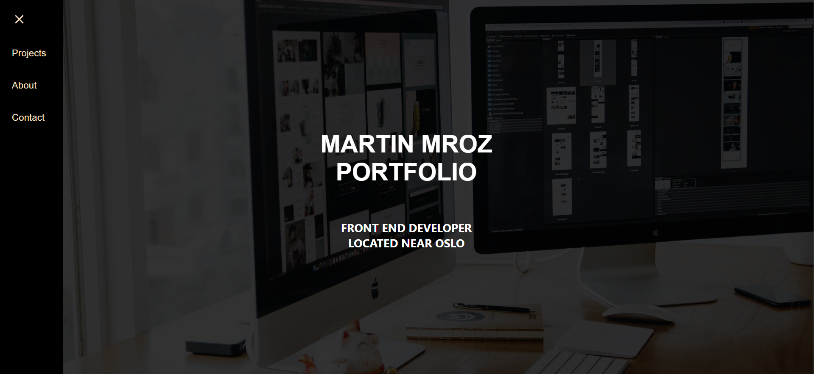

# My Portfolio

A showcase of my work as a web developer.

## Description

This portfolio is a personal website, designed to present my skills, experiences, and projects as a web developer. I've developed this project to be a platform where I can connect with people, from potential employers to other developers, and demonstrate my abilities and the kind of work I can do.

Key Features:

- Responsive web design, optimized for different screen sizes.
- Interactive user interface with smooth navigation.
- Showcases my best projects with links to live sites and source code.

## Built With

This project is built using the following technologies:

- [React.js](https://reactjs.org/)
- [Styled-components](https://styled-components.com/)
- [Material-UI](https://mui.com/)

## Getting Started

### Installing

To get this project running locally, follow these steps:

1. Clone the repository:

\`\`\`bash
git clone https://github.com/martinMr79/portfolio2.git
\`\`\`

2. Move to the project directory:

\`\`\`bash
cd portfolio2
\`\`\`

3. Install the dependencies:

\`\`\`bash
npm install
\`\`\`

### Running

To run the application, use the following command:

\`\`\`bash
npm start
\`\`\`

The application will now be running at `http://localhost:3000`.

## Contact

You can reach me at:

  [My Linkedin page](https://www.google.com/url?sa=t&rct=j&q=&esrc=s&source=web&cd=&cad=rja&uact=8&ved=2ahUKEwjk04jXp4r4AhUZRfEDHQMbCSYQFnoECAcQAQ&url=https%3A%2F%2Fno.linkedin.com%2Fin%2Fmartin-mroz-28008121a&usg=AOvVaw1SSNET_dDG4MRj1uQ6PD__)

  [Email](https://mamr@hotmail.no)

## License

This project is licensed under the MIT License.
